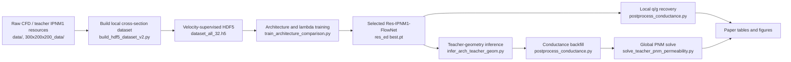

# Res-IPNM1-FlowNet pore-flow surrogate

This repository contains the current IPNM1 workflow for learning a local
geometry-to-velocity surrogate and converting the predicted velocity field into
flow rate, conductance, and finally network-scale permeability.

The current paper-facing model is **Ours / Res-IPNM1-FlowNet**:

- backbone: residual encoder-decoder, `res_ed`
- training script: `code/train_architecture_comparison.py`
- final selected setting: `L = L_field + 0.20 L_flux + 0.005 L_dist`
- seeds: `42, 43, 44`
- final checkpoints:
  `runs/lambda_selected_3seed_20260529/flux_0p2__dist_0p005__seed_<seed>/res_ed/best.pt`
- final model is a unified geometry-driven model: no rock classifier, no
  rock-type input channel, and no FiLM conditioning

Large local data and outputs are not committed. `data/`, `300x200x200_data/`,
`runs/`, `dataset_all_32.h5`, checkpoints, arrays, and large figures are kept
out of Git by `.gitignore`.

## Key Figures

### Method Overview


The route is geometry first: real throat cross-section -> Res-IPNM1-FlowNet
velocity field -> physical integration to local flow rate `q` -> IPNM1
conductance `g` -> conductance backfill into the teacher PNM pressure solver.

### Velocity Field Examples


The model predicts a dense axial velocity field, not only a scalar. This is the
main difference from direct `q` or `g` regression baselines.

### Local q/g Validation


Predicted velocity fields are integrated over the pore region to recover local
flow rate and conductance. The final evaluation checks both field accuracy and
scalar IPNM1 consistency.

### Main Metrics and Ablation


The final model is selected by conductance-facing metrics, with velocity-field
accuracy retained as a required constraint.

### Direct Scalar Baseline


Scalar baselines are useful negative/control experiments, but they do not
produce a velocity distribution for downstream transport analysis.

## Current Workflow



## 1. Prepare Local Data

The workflow assumes two local resources:

```text
data/                 # velocity-supervised CFD/Tecplot-style local samples
300x200x200_data/     # teacher IPNM1 geometry, conductance tables, PNM files
```

These directories are intentionally ignored because they are data resources,
not source code.

## 2. Build the HDF5 Training Dataset

`dataset_all_32.h5` is the velocity-supervised local cross-section dataset used
by the architecture comparison and lambda-selection workflow.

```bash
python code/build_hdf5_dataset_v2.py \
  --root data \
  --rocks 1 2 3 4 5 6 \
  --out_h5 dataset_all_32.h5 \
  --raw_patches 32 48 64 \
  --patch 32 \
  --stride_raw 4 \
  --R1 8 \
  --augment_rot90 \
  --compression gzip
```

The builder extracts pore masks and axial velocity fields, filters invalid
patches, recenters and rescales pore geometry, and stores geometry tensors,
velocity labels, `scale_s`, `rock_type`, `global_id`, and other metadata.

## 3. Train the Current Main Model

The final model is trained through the unified architecture-comparison script,
not through the older U-Net-only training path.

Single-seed example for the selected final setting:

```bash
python code/train_architecture_comparison.py \
  --h5 dataset_all_32.h5 \
  --split-json runs/final_ipnm1_flownet_flux010_30e/split_info.json \
  --data-root data \
  --out-dir runs/lambda_selected_3seed_20260529/flux_0p2__dist_0p005__seed_42 \
  --models res_ed \
  --epochs 100 \
  --batch-size 24 \
  --lambda-flux 0.20 \
  --lambda-dist 0.005 \
  --lambda-poisson 0 \
  --lambda-head 0.05 \
  --seed 42 \
  --device cuda \
  --patience 100 \
  --overwrite
```

To reproduce the paper-facing three-seed selected-lambda run:

```bash
python code/run_selected_lambda_seeds.py \
  --out-dir runs/lambda_selected_3seed_20260529 \
  --epochs 100
```

This wrapper trains four candidate lambda settings over seeds `42, 43, 44` and
summarizes them in:

```text
runs/lambda_selected_3seed_20260529/selected_lambda_seed_rows.csv
runs/lambda_selected_3seed_20260529/selected_lambda_group_summary.csv
```

The paper-facing model uses the `0.20 / 0.005` run:

```text
runs/lambda_selected_3seed_20260529/
  flux_0p2__dist_0p005__seed_42/res_ed/best.pt
  flux_0p2__dist_0p005__seed_43/res_ed/best.pt
  flux_0p2__dist_0p005__seed_44/res_ed/best.pt
```

## 4. Local Velocity, q, and Conductance Evaluation

`train_architecture_comparison.py` writes `predictions.npz` and summary files
for each trained architecture. Conductance recovery is then done explicitly:

```bash
python code/postprocess_conductance.py \
  --pred-file runs/lambda_selected_3seed_20260529/flux_0p2__dist_0p005__seed_42/res_ed/predictions.npz \
  --pred-key pred_ux \
  --true-file dataset_all_32.h5 \
  --true-key Y \
  --mask-file dataset_all_32.h5 \
  --mask-key X \
  --scale-file dataset_all_32.h5 \
  --scale-key scale_s \
  --index-file runs/lambda_selected_3seed_20260529/flux_0p2__dist_0p005__seed_42/res_ed/predictions.npz \
  --index-key index \
  --meta-file dataset_all_32.h5 \
  --spatial-axis-order yz \
  --flow-axis x \
  --flow-mode pressure \
  --conductance-mode ipnm2 \
  --delta-p 1.0 \
  --rho 1.0 \
  --ax 1.0e-4 \
  --segment-length 4.0 \
  --mu-lbm 0.5 \
  --target-mu 1.0 \
  --undo-velocity-normalization \
  --undo-area-normalization \
  --permeability-root data \
  --output-dir runs/lambda_selected_3seed_20260529/flux_0p2__dist_0p005__seed_42/res_ed/conductance_ipnm1_rho1
```

The key outputs are:

```text
conductance_results.csv
conductance_summary.json
```

## 5. Teacher-Geometry Inference and Global PNM Validation

The global validation does not stop at local q/g. The selected model is applied
to teacher IPNM1 throat geometries, the predicted conductance is backfilled into
the teacher PNM network, and the pressure solver computes global permeability.

The wrapper for the current three-seed global route is:

```bash
python code/run_ours_global_3seed.py \
  --teacher-geom-root runs/teacher_geom_full_all_20260529 \
  --ckpt-root runs/lambda_selected_3seed_20260529 \
  --out-dir runs/ours_global_3seed_20260530 \
  --seeds 42 43 44 \
  --batch-size 128 \
  --device cuda
```

Internally this calls:

```text
code/infer_arch_teacher_geom.py
code/postprocess_conductance.py
code/solve_teacher_pnm_permeability.py
```

Current recorded global result:

| Rock | Global K relative error |
| --- | ---: |
| Bead | 0.80% +/- 0.51% |
| Benth | 5.14% +/- 0.15% |
| Berea | 0.39% +/- 0.48% |
| Font | 4.38% +/- 0.53% |
| Mean | 2.68% +/- 2.23% |

The timing record reports `3.90 +/- 0.37 ms` per throat cross-section on the
current GPU/PyTorch environment. See `IPNM1_EXPERIMENT_COMPLETION.md`.

Important caveat: the teacher folders
`300x200x200_data/PNM_simulation/Benth` and
`300x200x200_data/PNM_simulation/Berea` contain identical PNM files for topology
and teacher conductance. Local geometry metrics remain valid, but global PNM
interpretation for those two folders should be cautious.

## 6. Architecture and Baseline Comparisons

The six-model comparison is managed by `train_architecture_comparison.py`.
The compared models are:

```text
Ours / res_ed
IPNM-FlowNet-style baseline
FNO
ConvNeXt-ED
Multi-task CNN
U-Net
```

In this repository, U-Net is a baseline or legacy route, not the current main
workflow. The older `code/train_unet_h5.py` and `code/infer_unet_h5.py` scripts
are kept for reproducibility of earlier experiments.

Paper-facing comparison sources are listed in `TODO_PLOTTING.md`, especially:

```text
runs/paper_six_model_full_comparison_20260530/six_model_full_comparison.csv
runs/ours_global_3seed_20260530/ours_global_3seed_summary.csv
runs/lambda_selected_3seed_20260529/selected_lambda_group_summary.csv
```

## Repository Layout

```text
.
  README.md                         # current workflow overview
  code/                             # data, training, inference, postprocess scripts
  docs/figures/                     # lightweight README figures
  experiments/                      # experiment notes
  makefig/                          # figure-planning notes
  IPNM1_EXPERIMENT_COMPLETION.md    # completed experiment records
  TODO_PLOTTING.md                  # paper-facing figure/data map
```

Ignored local resources:

```text
data/
300x200x200_data/
runs/
dataset_all_32.h5
*.pt, *.h5, *.npy, *.npz, large image outputs
```

## Script Index

| Script | Current role |
| --- | --- |
| `code/build_hdf5_dataset_v2.py` | Build `dataset_all_32.h5` from local CFD/Tecplot samples |
| `code/train_architecture_comparison.py` | Main training/comparison entry point; final model uses `--models res_ed` |
| `code/run_lambda_grid_ablation.py` | Lambda grid search over `lambda_flux` and `lambda_dist` |
| `code/run_selected_lambda_seeds.py` | Three-seed confirmation of selected lambda candidates |
| `code/infer_arch_teacher_geom.py` | Apply selected checkpoint to teacher geometry-only HDF5 files |
| `code/postprocess_conductance.py` | Convert predicted velocity fields to q/g conductance tables |
| `code/solve_teacher_pnm_permeability.py` | Backfill predicted conductance and solve global PNM permeability |
| `code/run_ours_global_3seed.py` | Current Ours global K validation wrapper |
| `code/run_global_architecture_comparison.py` | Global comparison wrapper for trained architecture checkpoints |
| `code/make_ipnm1_paper_figures.py` | Generate paper figures from local outputs |
| `code/train_unet_h5.py` | Legacy/U-Net route, not the current main model |
| `code/infer_unet_h5.py` | Legacy/U-Net inference route |

## Environment

Recommended environment:

```text
Python 3.10+
PyTorch with CUDA for training/inference
numpy
scipy
h5py
pandas
matplotlib
tqdm
scikit-image
```

Some local wrapper scripts currently contain absolute paths for the author's
Windows environment, for example `E:\mhw\1\cup` and
`D:\anaconda\envs\nnlnvv\python.exe`. If the project is moved, update those
constants or call the underlying scripts directly with explicit arguments.

## Minimal Reproduction Order

1. Prepare local `data/` and `300x200x200_data/`.
2. Build `dataset_all_32.h5` with `code/build_hdf5_dataset_v2.py`.
3. Train/compare models with `code/train_architecture_comparison.py`.
4. Run selected-lambda three-seed confirmation with
   `code/run_selected_lambda_seeds.py`.
5. Recover local q/g using `code/postprocess_conductance.py`.
6. Run teacher-geometry global validation with `code/run_ours_global_3seed.py`.
7. Generate paper figures using `code/make_ipnm1_paper_figures.py`.

