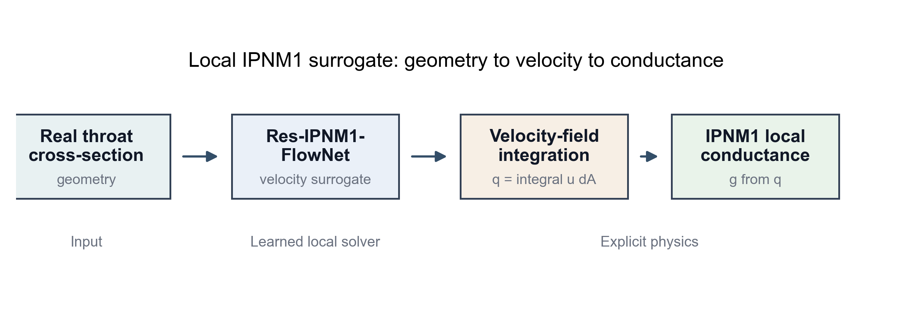
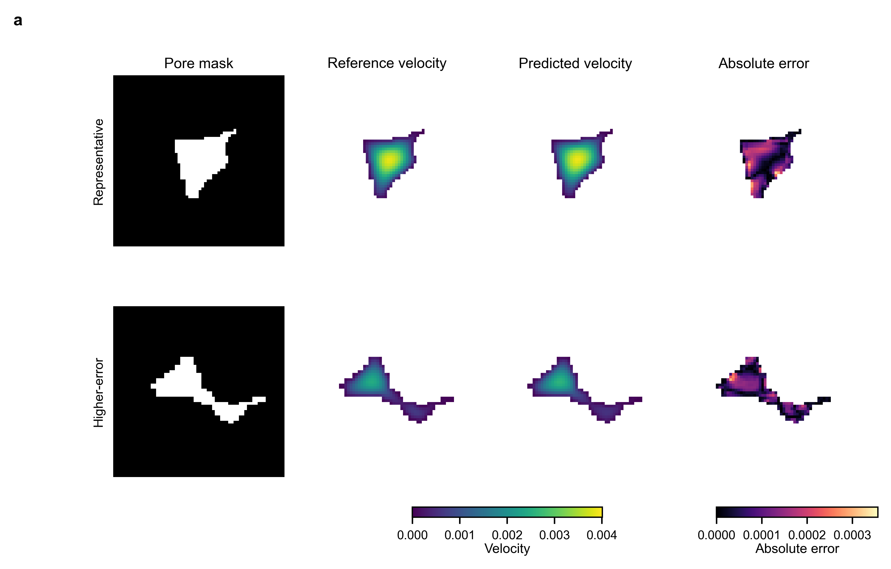
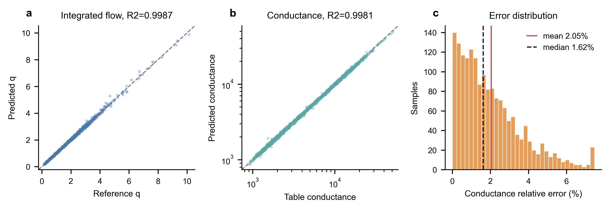
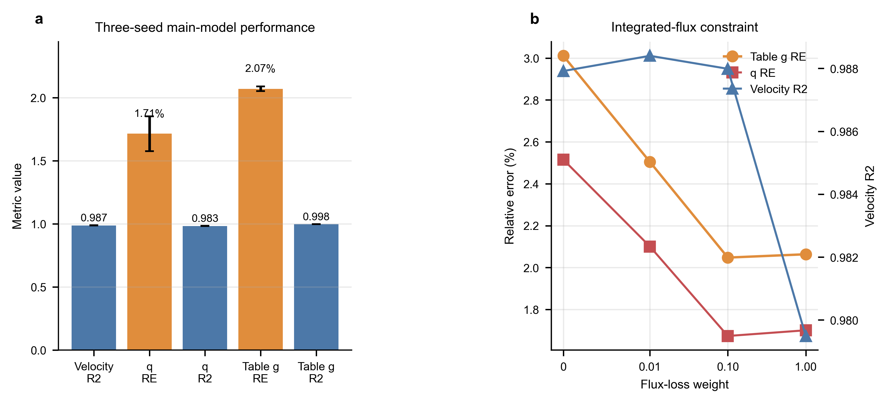
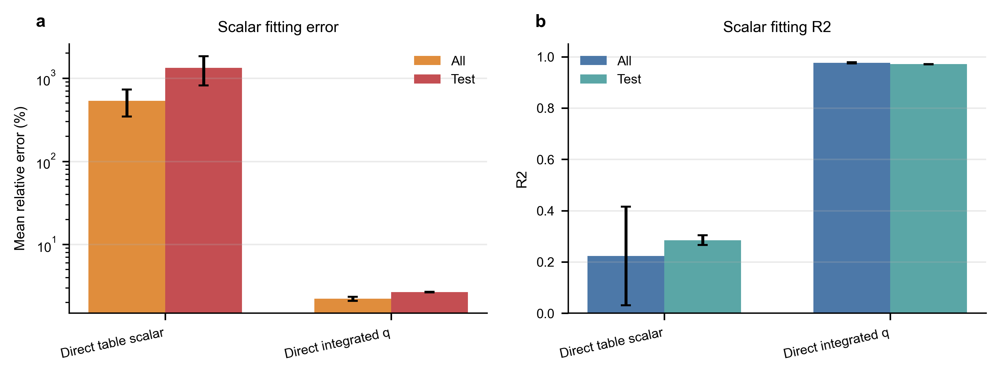

# IPNM1 pore-flow surrogate workflow

本仓库整理了一套面向多孔介质孔隙/喉道流动预测的深度学习工作流。核心目标是用神经网络从几何截面快速预测局部速度场与等效通量/导流能力，再把预测结果回填到 PNM 压力求解器中，验证全局渗透率是否能保持物理一致性。

> 数据、训练输出、模型权重和大体积结果没有上传到 GitHub。它们在本地保留于 `data/`、`300x200x200_data/`、`runs/`、`dataset_all_32.h5` 等路径，并已通过 `.gitignore` 排除。

## 关键图

### 方法总览



从 CFD/LBM 或 teacher PNM 几何中提取孔隙截面，构建标准化 patch 数据集；模型预测局部速度场/通量相关量；最后把神经网络预测的喉道导流能力用于 PNM 全局渗透率求解。

### 速度场预测示例



图中对比了真实速度场、模型预测速度场与局部误差，用来检查模型是否学到孔隙中心高速、壁面低速和固体区域为零的基本物理形态。

### 通量与导流能力验证



该图用于验证局部预测量与 teacher 结果的一致性，重点关注通量 `q`、导流能力 `g` 以及不同岩性样本上的拟合稳定性。

### 主结果与通量损失消融



该图汇总不同模型/损失设置的主要指标，展示通量约束、距离场约束和联合损失对全局/局部误差的影响。

### 直接标量基线



直接回归标量通量或导流能力可以作为轻量基线；与速度场代理模型对比时，用于判断“预测场再积分”和“直接标量预测”的误差差异。

## 工作流程

```mermaid
flowchart LR
    A["Raw CFD / PNM files<br/>data/, 300x200x200_data/"] --> B["Patch extraction<br/>build_hdf5_dataset_v2.py"]
    B --> C["HDF5 dataset<br/>dataset_all_32.h5"]
    C --> D["Velocity-field training<br/>train_unet_h5.py"]
    D --> E["Inference and metrics<br/>infer_unet_h5.py"]
    E --> F["Conductance postprocess<br/>postprocess_conductance.py"]
    F --> G["PNM pressure solve<br/>solve_pnm_with_conductance.py"]
    G --> H["Paper figures and tables<br/>make_ipnm1_paper_figures.py"]
```



### 1. 准备原始数据

本地数据目录通常包含六类岩石/孔隙结构样本：

```text
data/
  1/
  2/
  3/
  4/
  5/
  6/
300x200x200_data/
```

`data/` 主要用于从 CFD/Tecplot 输出构建局部截面数据集；`300x200x200_data/` 主要用于 teacher PNM 几何、喉道表和全局压力求解验证。二者体积较大，因此不进入 Git。

### 2. 构建 HDF5 数据集

推荐使用新版构建脚本：

```bash
python code/build_hdf5_dataset_v2.py \
  --root data \
  --rocks 1 2 3 4 5 6 \
  --out_h5 dataset_all_32.h5 \
  --raw_patches 32 48 64 \
  --patch 32 \
  --stride_raw 4 \
  --R1 8 \
  --augment_rot90 \
  --compression gzip
```

构建阶段完成以下处理：

- 解析 Tecplot/CFD 输出，读取孔隙 mask 与 `ux` 速度场。
- 按滑窗抽取局部 patch，并过滤触边、面积过小、中心孔隙不足或连通性差的样本。
- 对孔隙几何做中心对齐与尺度归一化。
- 生成输入通道，例如 `mask`、距离场 `dist`、局部孔隙率/辅助几何特征。
- 写出统一的 HDF5 数据集，供训练、推理和消融实验复用。

### 3. 训练速度场代理模型

主训练脚本是 `code/train_unet_h5.py`。它包含 U-Net/残差编码器、rock-type 条件化、FiLM、通量损失、壁面约束、单调性约束和若干标量辅助项。

```bash
python code/train_unet_h5.py \
  --h5 dataset_all_32.h5 \
  --out_dir runs/ipnm1_flownet \
  --epochs 200 \
  --batch_size 64 \
  --type_flux_balanced_sampler \
  --use_softplus \
  --use_rock_type_channel \
  --use_film \
  --lambda_q 10 \
  --q_mix
```

训练输出默认保存在 `runs/`：

```text
runs/ipnm1_flownet/
  best.pt
  last.pt
  config.json
  history.json
  training_log.csv
  loss_curves_comparison.png
```

这些文件用于本地复现实验，但不随仓库上传。

### 4. 推理与局部指标评估

```bash
python code/infer_unet_h5.py \
  --h5 dataset_all_32.h5 \
  --ckpt runs/ipnm1_flownet/best.pt \
  --out_dir runs/ipnm1_flownet/infer \
  --use_softplus \
  --use_rock_type_channel \
  --use_film \
  --save_field 1
```

推理阶段主要输出：

- `report.csv`：全体样本的误差指标。
- `report_by_rock_type.csv`：按岩性/类别统计的指标。
- `worst_cases.csv`：误差最大的样本。
- `predictions.npz` 或 `predictions.h5`：可选保存预测场。
- 可视化图：速度场对比、误差分布、通量散点图等。

### 5. 导流能力后处理与 PNM 验证

局部速度场预测不是终点。该项目进一步把预测结果转换为喉道导流能力，并回填到 PNM 网络求解全局渗透率。

典型流程：

```bash
python code/postprocess_conductance.py \
  --pred runs/ipnm1_flownet/infer/predictions.npz \
  --out_dir runs/ipnm1_flownet/conductance

python code/solve_pnm_with_conductance.py \
  --conductance_dir runs/ipnm1_flownet/conductance \
  --out_dir runs/ipnm1_flownet/pnm_solve
```

如果要跑三随机种子或多模型全局对比，可使用：

```bash
python code/run_ours_global_3seed.py
python code/run_global_architecture_comparison.py
```

当前完成记录见 `IPNM1_EXPERIMENT_COMPLETION.md`。其中三种子全局渗透率验证的平均相对误差约为 `2.68% +/- 2.23%`，Benth 和 Font 是更困难的全局 PNM case。

### 6. 汇总表格与论文图

图表生成脚本集中在：

```bash
python code/make_ipnm1_paper_figures.py
python code/make_selected_2_6_assets.py
python code/render_training_curves_from_history.py
python code/visualize_conductance_results.py
python code/visual_compare_velocity_fields.py
```

本 README 中展示的图来自本地 `runs/ipnm1_paper_figures_20260527/`，已复制为轻量 PNG 到 `docs/figures/` 便于 GitHub 预览。

## 目录结构

```text
.
  README.md                         # GitHub 首页工作流说明
  code/                             # 核心数据处理、训练、推理、后处理脚本
  docs/figures/                     # README 使用的关键轻量图
  experiments/                      # 实验说明与配置记录
  makefig/                          # 论文图构图说明
  IPNM1_EXPERIMENT_COMPLETION.md    # 实验补全和结果记录
  TODO_PLOTTING.md                  # 作图与论文材料 TODO
```

未上传但本地工作流会用到：

```text
data/                 # 原始/中间 CFD 数据
300x200x200_data/     # teacher PNM 几何与求解材料
runs/                 # 训练、推理、消融、图表输出
dataset_all_32.h5     # 构建后的 HDF5 数据集
```

## 核心脚本索引

| 脚本 | 作用 |
| --- | --- |
| `code/build_hdf5_dataset_v2.py` | 从原始 CFD/Tecplot 数据构建标准化 HDF5 patch 数据集 |
| `code/train_unet_h5.py` | 训练速度场代理模型，支持通量/壁面/单调性等物理约束 |
| `code/infer_unet_h5.py` | 加载 checkpoint 做推理，输出局部误差和可视化 |
| `code/postprocess_conductance.py` | 将预测速度场/通量后处理为喉道导流能力 |
| `code/solve_pnm_with_conductance.py` | 使用预测导流能力求解 PNM 全局渗透率 |
| `code/run_ours_global_3seed.py` | 运行 Ours 三随机种子全局 PNM 验证 |
| `code/run_global_architecture_comparison.py` | 汇总多模型全局渗透率对比 |
| `code/train_architecture_comparison.py` | 训练/比较不同神经网络结构 |
| `code/train_fno_baseline.py` | FNO 基线 |
| `code/train_poreflownet_baseline.py` | PoreFlow-Net 风格基线 |
| `code/train_scalar_q_baseline.py` | 直接标量通量/导流能力基线 |
| `code/make_ipnm1_paper_figures.py` | 生成论文主图 |

## 环境依赖

建议使用 Python 3.10+ 与 PyTorch。常用依赖包括：

```text
torch
numpy
scipy
h5py
pandas
matplotlib
tqdm
scikit-image
```

GPU 不是构建数据集的硬性要求，但训练和大规模推理建议使用 CUDA。

## 复现顺序

1. 准备本地 `data/` 与 `300x200x200_data/`。
2. 运行 `code/build_hdf5_dataset_v2.py` 生成 `dataset_all_32.h5`。
3. 运行 `code/train_unet_h5.py` 训练主模型。
4. 运行 `code/infer_unet_h5.py` 做局部速度场/通量评估。
5. 运行 `code/postprocess_conductance.py` 与 `code/solve_pnm_with_conductance.py` 做全局 PNM 验证。
6. 运行 `code/make_ipnm1_paper_figures.py` 生成论文图和汇总表。

