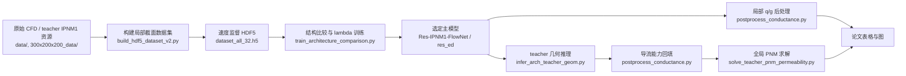

# Res-IPNM1-FlowNet 多孔介质流动代理模型

本仓库整理的是当前 IPNM1 论文路线的代码工作流：从局部喉道截面几何出发，预测轴向速度场，再通过显式物理积分得到局部流量 `q` 和导流能力 `g`，最后把预测导流能力回填到 teacher PNM 压力求解器中，验证网络尺度渗透率 `K`。

当前 paper-facing 主模型是 **Ours / Res-IPNM1-FlowNet**：

- 主干网络：残差编码-解码器，代码名 `res_ed`
- 主训练入口：`code/train_architecture_comparison.py`
- 最终损失：`L = L_field + 0.20 L_flux + 0.005 L_dist`
- 随机种子：`42, 43, 44`
- 最终 checkpoint：
  `runs/lambda_selected_3seed_20260529/flux_0p2__dist_0p005__seed_<seed>/res_ed/best.pt`
- 最终模型是统一的几何驱动模型：不做岩性分类，不使用 rock-type 输入通道，也不使用 FiLM 条件化

数据、训练输出、模型权重和大体积图像不上传到 GitHub。`data/`、`300x200x200_data/`、`runs/`、`dataset_all_32.h5`、`*.pt`、`*.npy`、`*.npz` 等都已由 `.gitignore` 排除。

## 关键图

### 方法总览


整体路线是：真实喉道截面几何 -> Res-IPNM1-FlowNet 预测速度场 -> 对孔隙区域做物理积分得到局部流量 `q` -> 按 IPNM1 约定换算导流能力 `g` -> 回填到 teacher PNM 网络中求解全局渗透率。

### 速度场预测示例


模型输出的是稠密轴向速度场，而不是只回归一个标量。这一点是当前方法区别于直接 `q/g` 标量基线的核心。

### 局部 q/g 验证


预测速度场先在孔隙区域积分得到局部流量，再换算导流能力。评估时同时检查速度场精度、流量一致性和导流能力一致性。

### 主结果与损失消融


最终模型不是只按像素误差选择，而是以导流能力相关指标为核心，同时要求速度场精度保持稳定。

### 直接标量基线


直接预测 `q` 或 `g` 可以作为对照实验，但它不会产生速度场，因此不能支持后续依赖局部速度分布的输运或传质分析。

## 当前工作流



## 1. 准备本地数据

当前工作流依赖两个本地资源：

```text
data/                 # 用于速度监督训练的 CFD/Tecplot 局部样本
300x200x200_data/     # teacher IPNM1 几何、导流能力表和 PNM 网络文件
```

这两个目录是数据资源，不属于源码仓库，因此不上传。

## 2. 构建 HDF5 训练集

`dataset_all_32.h5` 是当前结构比较和 lambda 选择使用的速度监督局部截面数据集。

```bash
python code/build_hdf5_dataset_v2.py \
  --root data \
  --rocks 1 2 3 4 5 6 \
  --out_h5 dataset_all_32.h5 \
  --raw_patches 32 48 64 \
  --patch 32 \
  --stride_raw 4 \
  --R1 8 \
  --augment_rot90 \
  --compression gzip
```

该步骤会完成：

- 解析原始 CFD/Tecplot 输出，得到孔隙 mask 和轴向速度场标签。
- 滑窗提取局部截面 patch。
- 过滤无效样本，例如触边、孔隙面积过小、中心孔隙不足或连通性差的样本。
- 对孔隙几何做中心对齐和尺度归一化。
- 写入几何张量、速度标签、`scale_s`、`rock_type`、`global_id` 等元数据。

## 3. 训练当前主模型

当前主模型通过统一结构比较脚本训练，不是旧的 U-Net 单一路线。

单个 seed 的最终设置示例：

```bash
python code/train_architecture_comparison.py \
  --h5 dataset_all_32.h5 \
  --split-json runs/final_ipnm1_flownet_flux010_30e/split_info.json \
  --data-root data \
  --out-dir runs/lambda_selected_3seed_20260529/flux_0p2__dist_0p005__seed_42 \
  --models res_ed \
  --epochs 100 \
  --batch-size 24 \
  --lambda-flux 0.20 \
  --lambda-dist 0.005 \
  --lambda-poisson 0 \
  --lambda-head 0.05 \
  --seed 42 \
  --device cuda \
  --patience 100 \
  --overwrite
```

复现三随机种子的最终 lambda 选择：

```bash
python code/run_selected_lambda_seeds.py \
  --out-dir runs/lambda_selected_3seed_20260529 \
  --epochs 100
```

该脚本会在 seeds `42, 43, 44` 上训练多个候选 lambda 组合，并输出：

```text
runs/lambda_selected_3seed_20260529/selected_lambda_seed_rows.csv
runs/lambda_selected_3seed_20260529/selected_lambda_group_summary.csv
```

当前论文主模型使用 `lambda_flux=0.20`、`lambda_dist=0.005`：

```text
runs/lambda_selected_3seed_20260529/
  flux_0p2__dist_0p005__seed_42/res_ed/best.pt
  flux_0p2__dist_0p005__seed_43/res_ed/best.pt
  flux_0p2__dist_0p005__seed_44/res_ed/best.pt
```

## 4. 局部速度场、q 和 g 评估

`train_architecture_comparison.py` 会为每个训练结构输出 `predictions.npz` 和 `summary.json`。随后使用 `postprocess_conductance.py` 显式恢复局部流量和导流能力。

示例：

```bash
python code/postprocess_conductance.py \
  --pred-file runs/lambda_selected_3seed_20260529/flux_0p2__dist_0p005__seed_42/res_ed/predictions.npz \
  --pred-key pred_ux \
  --true-file dataset_all_32.h5 \
  --true-key Y \
  --mask-file dataset_all_32.h5 \
  --mask-key X \
  --scale-file dataset_all_32.h5 \
  --scale-key scale_s \
  --index-file runs/lambda_selected_3seed_20260529/flux_0p2__dist_0p005__seed_42/res_ed/predictions.npz \
  --index-key index \
  --meta-file dataset_all_32.h5 \
  --spatial-axis-order yz \
  --flow-axis x \
  --flow-mode pressure \
  --conductance-mode ipnm2 \
  --delta-p 1.0 \
  --rho 1.0 \
  --ax 1.0e-4 \
  --segment-length 4.0 \
  --mu-lbm 0.5 \
  --target-mu 1.0 \
  --undo-velocity-normalization \
  --undo-area-normalization \
  --permeability-root data \
  --output-dir runs/lambda_selected_3seed_20260529/flux_0p2__dist_0p005__seed_42/res_ed/conductance_ipnm1_rho1
```

关键输出：

```text
conductance_results.csv
conductance_summary.json
```

## 5. teacher 几何推理与全局 PNM 验证

全局验证不只看局部 `q/g`。当前路线会把选定模型应用到 teacher IPNM1 throat 几何上，将预测导流能力回填到 teacher PNM 网络，然后求解全局渗透率 `K`。

三随机种子全局验证入口：

```bash
python code/run_ours_global_3seed.py \
  --teacher-geom-root runs/teacher_geom_full_all_20260529 \
  --ckpt-root runs/lambda_selected_3seed_20260529 \
  --out-dir runs/ours_global_3seed_20260530 \
  --seeds 42 43 44 \
  --batch-size 128 \
  --device cuda
```

该 wrapper 内部调用：

```text
code/infer_arch_teacher_geom.py
code/postprocess_conductance.py
code/solve_teacher_pnm_permeability.py
```

当前记录的全局渗透率结果：

| 岩样 | 全局 K 相对误差 |
| --- | ---: |
| Bead | 0.80% +/- 0.51% |
| Benth | 5.14% +/- 0.15% |
| Berea | 0.39% +/- 0.48% |
| Font | 4.38% +/- 0.53% |
| Mean | 2.68% +/- 2.23% |

推理效率记录为 `3.90 +/- 0.37 ms` 每个 throat cross-section，详见 `IPNM1_EXPERIMENT_COMPLETION.md`。

注意：`300x200x200_data/PNM_simulation/Benth` 和 `300x200x200_data/PNM_simulation/Berea` 的 PNM topology 与 teacher conductance 文件相同。因此局部几何指标仍然有效，但这两个文件夹的全局 PNM 对比需要谨慎解释。

## 6. 结构和基线对比

六模型对比由 `train_architecture_comparison.py` 管理。对比对象包括：

```text
Ours / res_ed
IPNM-FlowNet-style baseline
FNO
ConvNeXt-ED
Multi-task CNN
U-Net
```

这里的 U-Net 是基线或旧实验路线，不是当前主工作流。`code/train_unet_h5.py` 和 `code/infer_unet_h5.py` 保留用于复现实验历史。

论文相关表格来源见 `TODO_PLOTTING.md`，主要包括：

```text
runs/paper_six_model_full_comparison_20260530/six_model_full_comparison.csv
runs/ours_global_3seed_20260530/ours_global_3seed_summary.csv
runs/lambda_selected_3seed_20260529/selected_lambda_group_summary.csv
```

## 仓库结构

```text
.
  README.md                         # 当前工作流说明
  code/                             # 数据处理、训练、推理、后处理脚本
  docs/figures/                     # README 使用的轻量图
  experiments/                      # 实验说明
  makefig/                          # 论文图构图说明
  IPNM1_EXPERIMENT_COMPLETION.md    # 已完成实验记录
  TODO_PLOTTING.md                  # 论文图与数据来源映射
```

本地保留但不上传的资源：

```text
data/
300x200x200_data/
runs/
dataset_all_32.h5
*.pt, *.h5, *.npy, *.npz, 大体积图像输出
```

## 脚本索引

| 脚本 | 当前作用 |
| --- | --- |
| `code/build_hdf5_dataset_v2.py` | 从本地 CFD/Tecplot 样本构建 `dataset_all_32.h5` |
| `code/train_architecture_comparison.py` | 主训练和结构比较入口；最终模型使用 `--models res_ed` |
| `code/run_lambda_grid_ablation.py` | 搜索 `lambda_flux` 与 `lambda_dist` |
| `code/run_selected_lambda_seeds.py` | 三随机种子确认候选 lambda |
| `code/infer_arch_teacher_geom.py` | 将选定 checkpoint 应用于 teacher geometry-only HDF5 |
| `code/postprocess_conductance.py` | 将预测速度场换算为 `q/g` 导流能力表 |
| `code/solve_teacher_pnm_permeability.py` | 回填预测导流能力并求解全局 PNM 渗透率 |
| `code/run_ours_global_3seed.py` | 当前 Ours 三随机种子全局 K 验证 |
| `code/run_global_architecture_comparison.py` | 多结构 checkpoint 的全局对比 |
| `code/make_ipnm1_paper_figures.py` | 从本地结果生成论文图 |
| `code/train_unet_h5.py` | 旧版/U-Net 路线，不是当前主模型 |
| `code/infer_unet_h5.py` | 旧版/U-Net 推理路线 |

## 环境依赖

建议环境：

```text
Python 3.10+
PyTorch + CUDA
numpy
scipy
h5py
pandas
matplotlib
tqdm
scikit-image
```

部分 wrapper 脚本中仍保留作者本机 Windows 绝对路径，例如 `E:\mhw\1\cup` 和 `D:\anaconda\envs\nnlnvv\python.exe`。如果迁移项目，需要修改这些常量，或直接调用底层脚本并显式传参。

## 最小复现顺序

1. 准备本地 `data/` 和 `300x200x200_data/`。
2. 用 `code/build_hdf5_dataset_v2.py` 构建 `dataset_all_32.h5`。
3. 用 `code/train_architecture_comparison.py` 训练/比较模型结构。
4. 用 `code/run_selected_lambda_seeds.py` 跑三随机种子 lambda 确认。
5. 用 `code/postprocess_conductance.py` 恢复局部 `q/g`。
6. 用 `code/run_ours_global_3seed.py` 做 teacher PNM 全局验证。
7. 用 `code/make_ipnm1_paper_figures.py` 生成论文图。

